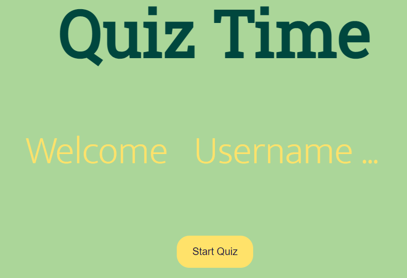
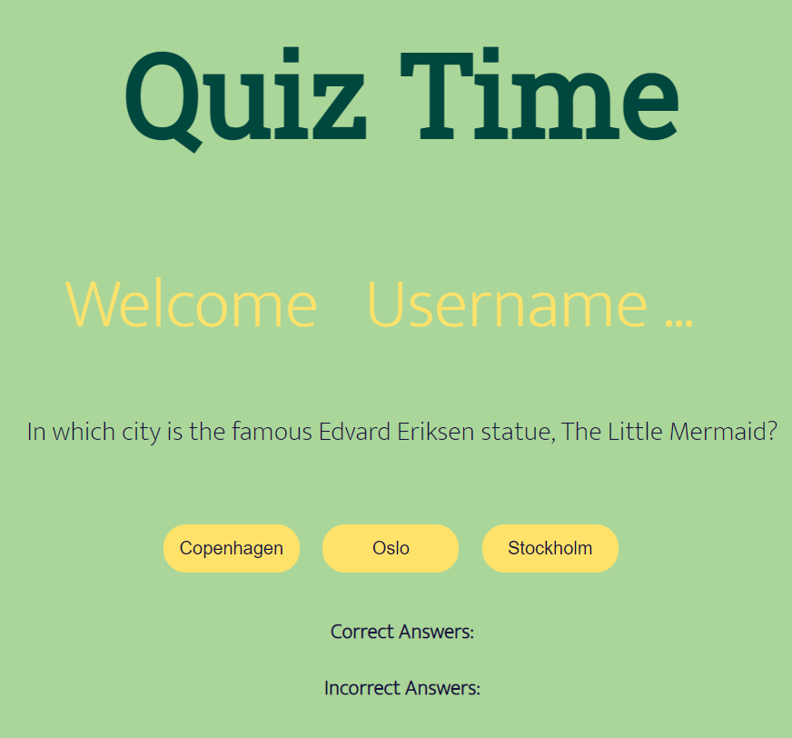
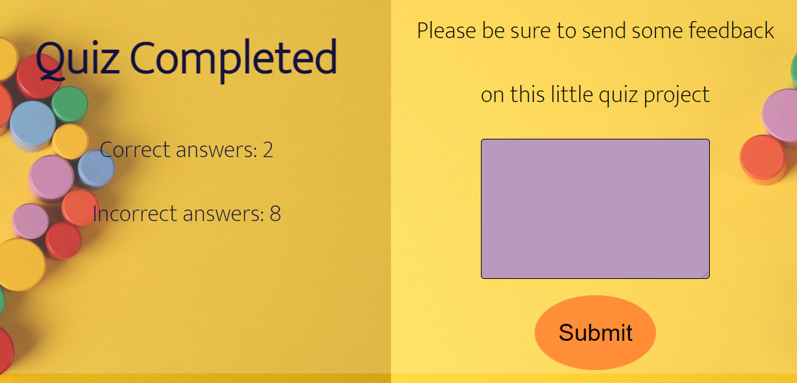

<h1>Quiz Time</h1>
<h2> Simple little Quiz Game with ten questions.</h2>

<h2>Customization</h2>

If you want to customize the quiz, you can modify the script.js file to add, remove, or modify questions.

<h3>

question: the text of the question

answers: an array of possible answers, each stored as an object with the following properties:

  

ext: the text of the answer
correct: a boolean value indicating whether the answer is correct or not { text : correct
You can add as many questions as you like,to the questions array.

{
    question: ' insert question here.... ',
    answers: [
          
      { text: 'answer here', correct: true },
      
      { text: 'answer here', correct: false }
    ]
  },</h3>

<h2>Usage</h2>
<h3>
To start the quiz, simply choose a username and then  click the "Start Quiz" button.
 You'll be presented with a series of questions, each with three different options answers.
Select the answer that you think is correct, and click that answer button to move on to the next question. 
At the end of the quiz, you'll be shown your final score and given the option to restart the quiz.</h3>

<h2>Credits</h2>

<ol>
  <li>https://ahaslides.com/blog/funny-pub-quiz-questions/</li>
  
 the site where i sourced the questions in this quiz. 

  <li>https://www.youtube.com/watch?v=riDzcEQbX6k&list=PLXy0WVQprv4tFVbRmQasmLho4xIY73yvo&index=33</li>
  
inspired me alot this video for the quiz game.

</ol>

<h3>Languages used inside of the project is:</h3>
<ol>
<li>Html</li>
<li>Css</li>
<li>Javascript</li>
</ol>

